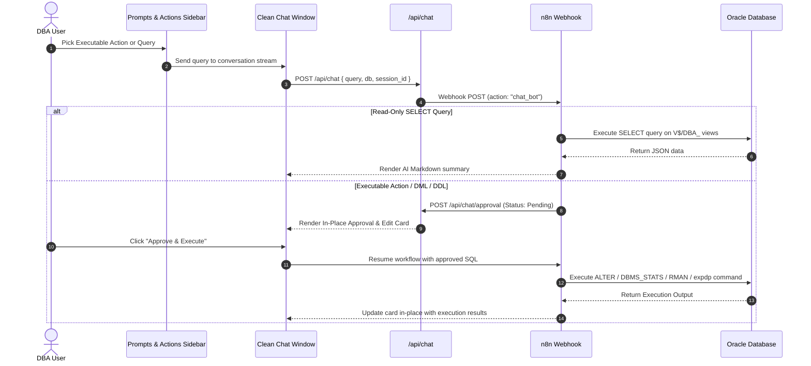

# Chat with DB — Oracle Database n8n AI Workflow & Prompts/Actions Catalog

The **Chat with DB** module enables DBAs to query Oracle Databases or perform administrative database activities in plain English. The user's prompt is dispatched to an n8n webhook workflow where an LLM node converts natural language to Oracle SQL/commands, executes them against Oracle, and a second LLM node summarizes the results into clean Markdown.

---

## 1. UI & Workflow Architecture

### Clean Chat Window & DB Prompts/Actions Sidebar Drawer
- **Clean Chat Window**: The chat message area is kept 100% clean and dedicated strictly to user/assistant message bubbles, streaming indicators, and SQL approval cards — no prompt strips or galleries inside the message stream.
- **Dedicated Prompts & Actions Sidebar**: A toggleable side panel (`[⚡ DB Prompts & Actions]`) that displays categorized database activities and queries.
- **Type Badges**:
  - `⚡ EXECUTABLE ACTION`: Administrative operations (killing sessions, resizing datafiles, recompiling objects, gathering stats, flushing shared pool, unlocking accounts, triggering backups/expdp) that trigger the **Unsafe Query Approval Flow**.
  - `🔍 READ-ONLY QUERY`: Diagnostic SELECT queries executed directly.

---

## 2. Complete Prompts & Database Activities Catalog

### ⚡ Executable Database Activities (`type: "action"`)

| Short Title | Natural Language Prompt | Oracle Command / API | Description |
| :--- | :--- | :--- | :--- |
| **Kill Blocking Session** | `Kill blocking session SID 142 serial# 5210` | `ALTER SYSTEM KILL SESSION '142,5210' IMMEDIATE` | Terminates blocking locks and clears resource contention. |
| **Add Datafile to Tablespace** | `Add a 10GB datafile to USERS tablespace with autoextend enabled` | `ALTER TABLESPACE USERS ADD DATAFILE ... AUTOEXTEND ON` | Expands storage capacity by adding a new autoextensible file. |
| **Recompile Invalid Objects** | `Recompile all invalid packages, procedures, and views in APPS schema` | `UTL_RECOMP.RECOMP_PARALLEL('APPS')` | Runs parallel compilation for invalid schema packages & triggers. |
| **Gather Optimizer Statistics** | `Gather optimizer statistics for table ORDERS in APPS schema with cascade` | `DBMS_STATS.GATHER_TABLE_STATS('APPS', 'ORDERS')` | Updates CBO statistics for accurate SQL execution paths. |
| **Flush Shared Pool** | `Flush shared pool to clear invalid cursor cache and bad execution plans` | `ALTER SYSTEM FLUSH SHARED_POOL` | Purges SGA cursor cache to clear bad plan regressions. |
| **Unlock Account & Expire Password** | `Unlock user account HR and expire password for security reset` | `ALTER USER HR ACCOUNT UNLOCK PASSWORD EXPIRE` | Unlocks user account and forces password change on next login. |
| **Trigger RMAN Database Backup** | `Take an immediate RMAN full database backup including archivelogs` | `EXEC RMAN BACKUP DATABASE PLUS ARCHIVELOG` | Initiates RMAN database backup including archived redo logs. |
| **Trigger Data Pump Export** | `Start a schema Data Pump export (expdp) for SCOTT schema to DATA_PUMP_DIR` | `DBMS_DATAPUMP.OPEN('EXPORT', 'SCHEMA')` | Launches schema Data Pump export job via DBMS_DATAPUMP API. |

---

### 🔍 Diagnostic Read-Only Queries (`type: "query"`)

| Short Title | Natural Language Prompt | Target Oracle Views | Description |
| :--- | :--- | :--- | :--- |
| **Blocking Locks** | `Find blocking sessions and lock details in the database` | `V$LOCK`, `V$SESSION` | Identifies session SIDs, lock types, blocked wait trees, and holding queries. |
| **Top SQL by CPU & I/O** | `Show top 10 SQL queries consuming highest CPU and disk reads` | `V$SQL`, `V$SQLAREA` | Retrieves SQL ID, execution count, CPU time, buffer gets, and SQL text. |
| **Long Running Operations** | `Show long running operations currently in progress` | `V$SESSION_LONGOPS` | Tracks active operations with % completion, elapsed time, and target tables. |
| **Top System Wait Events** | `List top database wait events and system wait statistics right now` | `V$SYSTEM_EVENT`, `V$SESSION_WAIT` | Identifies wait classes, total wait counts, and time waited in seconds. |
| **Tablespace Free Space** | `Show all tablespaces, total allocated size, free space, and usage percentage` | `DBA_TABLESPACES`, `DBA_DATA_FILES`, `DBA_FREE_SPACE` | Reports total allocated size, free MB, and percent used per tablespace. |
| **Full & Autoextend Files** | `Find datafiles near full capacity or with autoextend disabled` | `DBA_DATA_FILES` | Audits datafiles approaching max size or lacking autoextension setup. |
| **TEMP Space & Sort Usage** | `Check TEMP tablespace usage and active sort segments by session` | `V$SORT_USAGE`, `V$TEMP_SPACE_HEADER` | Identifies sessions allocating temporary segments and sort blocks. |
| **ASM Diskgroups** | `Show ASM diskgroups total capacity, free space, and redundancy state` | `V$ASM_DISKGROUP` | Displays disk group health, total capacity, usable free GB, and offline disks. |
| **Active User Sessions** | `List active user sessions with username, machine, program, and current SQL` | `V$SESSION`, `V$SQL` | Filters non-background active user sessions with client details. |
| **Top PGA / Memory Usage** | `Find top 10 sessions consuming maximum PGA and UGA memory` | `V$PROCESS`, `V$SESSION` | Identifies memory allocation by session SID, username, and OS process ID. |
| **RMAN Backup Status** | `Check RMAN backup summary and execution status for the last 7 days` | `V$RMAN_STATUS`, `V$RMAN_BACKUP_JOB_DETAILS` | Audits full, incremental, and archivelog backup job completion states. |
| **Data Guard Standby Sync** | `Check Data Guard standby synchronization gap and apply lag` | `V$DATAGUARD_STATS`, `V$MANAGED_STANDBY` | Checks transport lag, apply lag, and missing sequence numbers. |
| **Invalid Objects Summary** | `Show invalid objects in database grouped by owner schema and object type` | `DBA_OBJECTS` | Lists invalid packages, procedures, functions, triggers, and views. |
| **Locked & Expired Users** | `Show locked user accounts, expired passwords, and password change dates` | `DBA_USERS` | Reports user account locking state, lock timestamp, and expiry date. |
| **DBA & SYSDBA Privileges** | `List users granted SYSDBA privilege or DBA role in the database` | `DBA_ROLE_PRIVS`, `V$PWFILE_USERS` | Audits accounts holding administrative roles or SYSDBA privileges. |
