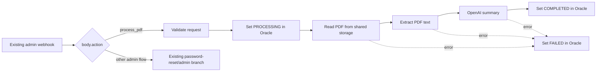

# Security Posture n8n workflow

This guide processes a newly uploaded Nessus PDF, produces an AI security summary, and writes the result into `APP_SECURITY_POSTURE_REPORTS`. It is designed for the current deployment where Security Posture shares the existing `NEXT_PUBLIC_ADMIN_WEBHOOK_URL` endpoint.

## Before you start

1. Apply [the Oracle migration](../db/oracle_security_posture_reports.sql) as the portal schema owner.
2. Restart the Next.js application after adding the Security Posture environment variables. The relevant local configuration is:

   ```dotenv
   SECURITY_POSTURE_N8N_WEBHOOK_URL=http://localhost:5678/webhook-test/f9c3cdfb-4e5d-4754-92e5-4ff77c472077
   SECURITY_POSTURE_N8N_WEBHOOK_TOKEN=<strong-shared-token>
   ```

3. Set `SECURITY_POSTURE_N8N_WEBHOOK_TOKEN` as an n8n environment variable with the identical value. The application also sends `X-Admin-Webhook-Secret`, so the existing admin webhook secret can authenticate the request too.
4. Make the upload folder available to the n8n process. If both services run on the same Windows/Linux host, they can use the same absolute path. If n8n runs in a Docker container, mount the host's upload folder into the n8n container (e.g. `-v C:\DATAPUMP:/data`), set the `SECURITY_POSTURE_N8N_UPLOAD_DIR` environment variable in the n8n container to `/data` to enable automatic path mapping, and set the `N8N_RESTRICT_FILE_ACCESS_TO=/data` environment variable to authorize n8n to read files from that directory.
5. Add an Oracle credential in n8n for the portal schema and an OpenAI credential. The Oracle account needs `SELECT`/`UPDATE` on `APP_SECURITY_POSTURE_REPORTS`.

> `webhook-test` only works while the workflow is in manual **Listen for test event** mode. After activation, n8n normally exposes `/webhook/...`, not `/webhook-test/...`. If this is a production endpoint, change both `NEXT_PUBLIC_ADMIN_WEBHOOK_URL` and `SECURITY_POSTURE_N8N_WEBHOOK_URL` to the active `/webhook/...` URL.

## Recommended: add the branch to the existing admin workflow

Do not create a second Webhook node at the same URL; n8n allows only one active workflow for a webhook path. Open the workflow currently serving `NEXT_PUBLIC_ADMIN_WEBHOOK_URL` and add this branch immediately after its Webhook node.



### 1. Add a Switch node

After the current Webhook node, add **Switch** named `Route request`.

- Value to evaluate: `={{ $json.body.action || $json.action || '' }}`
- Rule 1: `equals` → `process_pdf`
- Fallback output: connect to the current admin/password-reset path unchanged.

Connect the `process_pdf` output to the nodes below. This preserves all existing reset-password behaviour.

### 2. Validate the request

Add a **Code** node named `Validate Security Posture Request` with this JavaScript:

```javascript
const incoming = $input.first().json;
const rawHeaders = incoming.headers || {};
const headers = {};

for (const [key, value] of Object.entries(rawHeaders)) {
  headers[key.toLowerCase()] = Array.isArray(value) ? String(value[0] || '') : String(value || '');
}

const securityToken = headers['x-security-posture-token'] || '';
const adminSecret = headers['x-admin-webhook-secret'] || '';

const expectedSecurityToken = $env.SECURITY_POSTURE_N8N_WEBHOOK_TOKEN || 'replace-with-strong-shared-token';
const expectedAdminSecret = $env.ADMIN_WEBHOOK_SECRET || 'replace-with-strong-shared-secret';

const securityTokenOk = expectedSecurityToken && securityToken === expectedSecurityToken;
const adminSecretOk = expectedAdminSecret && adminSecret === expectedAdminSecret;

if (!securityTokenOk && !adminSecretOk) {
  throw new Error('Invalid Security Posture webhook token');
}

const body = incoming.body || incoming;
if (body.action !== 'process_pdf') throw new Error('Unexpected action');
if (!Number.isInteger(Number(body.document_id)) || Number(body.document_id) < 1) {
  throw new Error('document_id must be a positive integer');
}
if (typeof body.file_path !== 'string' || !body.file_path.trim()) {
  throw new Error('file_path is required');
}

// Resolve filepath if n8n is containerized/cross-OS and SECURITY_POSTURE_N8N_UPLOAD_DIR is set
let filePath = body.file_path.trim();
const containerUploadDir = $env.SECURITY_POSTURE_N8N_UPLOAD_DIR || '';
if (containerUploadDir) {
  const filename = filePath.split(/[/\\]/).pop() || '';
  filePath = containerUploadDir.endsWith('/') || containerUploadDir.endsWith('\\')
    ? `${containerUploadDir}${filename}`
    : `${containerUploadDir}/${filename}`;
}

return [{
  json: {
    document_id: Number(body.document_id),
    database_id: Number(body.database_id),
    file_path: filePath
  }
}];
```

### 3. Mark the report as processing

Add an **Oracle** node (the `n8n-nodes-oracle` community node) named `Mark Processing` using the Oracle credential created above.

```sql
UPDATE app_security_posture_reports
SET processing_status = 'PROCESSING', error_message = NULL
WHERE report_id = :document_id
  AND is_active = 'Y'
```

Map `document_id` to `={{ $json.document_id }}` and enable commit/auto-commit if that option is available in your Oracle node version.

### 4. Read and extract the PDF

1. Add **Read/Write Files from Disk** (or legacy **Read Binary File**) named `Read Uploaded PDF`.
   - File path: `={{ $('Validate Security Posture Request').first().json.file_path }}`
   - Binary property: `data`
2. Add **Extract From File** named `Extract PDF Text`.
   - Operation: `Extract text from PDF`
   - Input binary property: `data`

The Next.js application intentionally sends a filesystem location, not a URL. Do not expose the upload directory over HTTP.

### 5. Generate the AI summary

Add an **OpenAI** node named `Generate AI Summary`.

- Resource: `Text`
- Operation: `Message a model`
- Model: your approved model, for example `gpt-4.1-mini`
- Temperature: `0.2`
- User message:

```text
You are a senior Oracle database security analyst. Summarize this Nessus report
for the client database. State overall risk, critical/high findings,
Oracle-specific exposure, prioritised remediation, and important
false-positive or validation caveats. Be concise and use Markdown headings.

REPORT:
{{ $json.text }}
```

If your Extract From File node returns a differently named field, replace `$json.text` with that field after inspecting its execution output.

### 6. Persist a completed summary

Add a second **Oracle** node named `Save Completed Summary`:

```sql
UPDATE app_security_posture_reports
SET processing_status = 'COMPLETED',
    ai_summary = :summary,
    ai_model = :model,
    summary_generated_at = SYSTIMESTAMP,
    error_message = NULL
WHERE report_id = :document_id
  AND is_active = 'Y'
```

Use these parameters:

| Oracle bind | n8n expression |
| --- | --- |
| `document_id` | `={{ $('Validate Security Posture Request').first().json.document_id }}` |
| `summary` | `={{ $json.message?.content || $json.text || JSON.stringify($json) }}` |
| `model` | `gpt-4.1-mini` (or the selected model name) |

### 7. Persist failures

Add another **Oracle** node named `Save Processing Failure`:

```sql
UPDATE app_security_posture_reports
SET processing_status = 'FAILED',
    error_message = :message
WHERE report_id = :document_id
  AND is_active = 'Y'
```

Set the `Read Uploaded PDF`, `Extract PDF Text`, and `Generate AI Summary` nodes to **On Error → Continue (using error output)**. Connect each error output to `Save Processing Failure`.

| Oracle bind | n8n expression |
| --- | --- |
| `document_id` | `={{ $('Validate Security Posture Request').first().json.document_id }}` |
| `message` | `={{ $json.error?.message || $json.message || 'PDF extraction or AI summary generation failed' }}` |

## Importable standalone workflow

[security-posture-n8n-workflow.json](./security-posture-n8n-workflow.json) is an importable equivalent for a **separate** `/webhook/security-posture` endpoint. It is useful for a fresh n8n instance, but do not activate it with the same webhook path as the existing admin workflow. Replace its placeholder Oracle/OpenAI credential IDs after import.

## Test checklist

1. Select a database owned by a Client user and upload a small real PDF.
2. Confirm the UI immediately shows the uploader, upload time, and `UPLOADED` or `PROCESSING`.
3. In n8n, confirm `Mark Processing` succeeds and the file-read path exists.
4. Confirm Oracle receives `COMPLETED`, `AI_SUMMARY`, `AI_MODEL`, and `SUMMARY_GENERATED_AT`.
5. Open **Summary** and download the report through the portal; neither action should reveal a filesystem path.
6. Temporarily use an unreadable path or invalid AI credential and confirm the row becomes `FAILED` with a useful error message.
